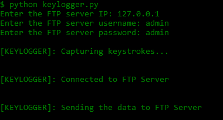

# Keylogger - Python

## Description 

A Simple Keylogger Program Written in Python.

## Dependencies

* pynput
  * pip install pynput

## Installation

* git clone https://github.com/passc0de/keylogger-python

*  cd keylogger-python/

## Usage

* python keylogger.py

## Output

